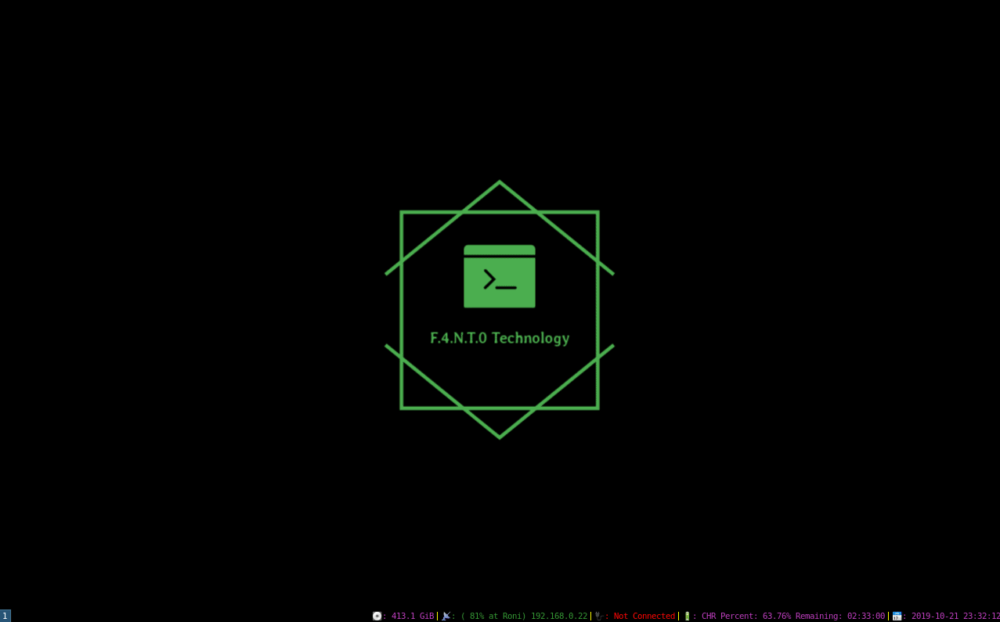

# Welcome to my i3wm Configuration Repository

This Repository works to Configure an i3wm with programs to help programming, every directory here serve to make an step on the configuration of Your liked Distro

These is how my configuration is going

* These are the Directories on this Repository in order of importancy

|Importancy|Name|Use|Link
|---|---|---|---|
1|**i3_config**|Install and Config i3wm|[Click Here](i3_config)
2|**i3_commands**| Commands and how to use i3wm|[Click Here](i3_commands)
3|**i3_gaps**| How to install and config gaps on i3|[CLick Here](i3_gaps)
4|**compton**| Control de Transparency from i3 terminal| [Click Here](compton)
5|**gtop**| Control what is happening with gtop|[Click Here](gtop)
6|**ranger**| See files on terminal using VIM commands|[Click Here](ranger)
7|**i3status**| Config from i3status|[Click Here](i3_status)
8|**theme**| Import/Export the theme from my system|[Click Here](theme)

