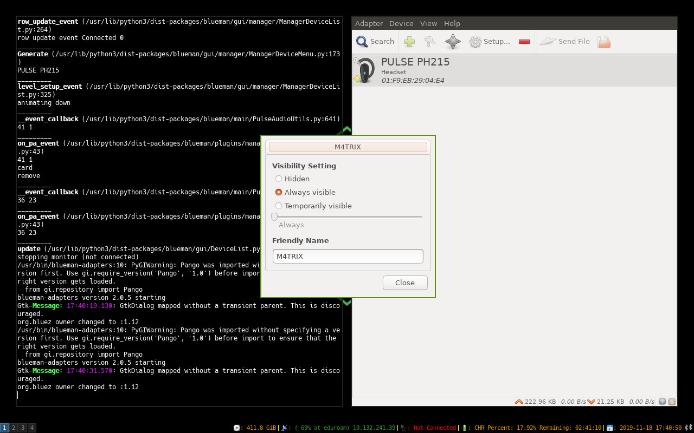
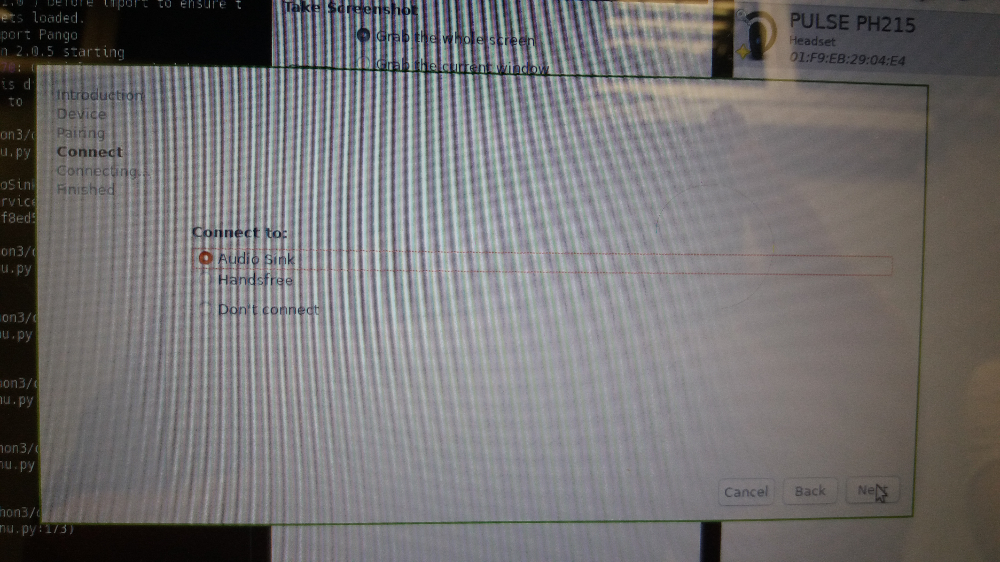
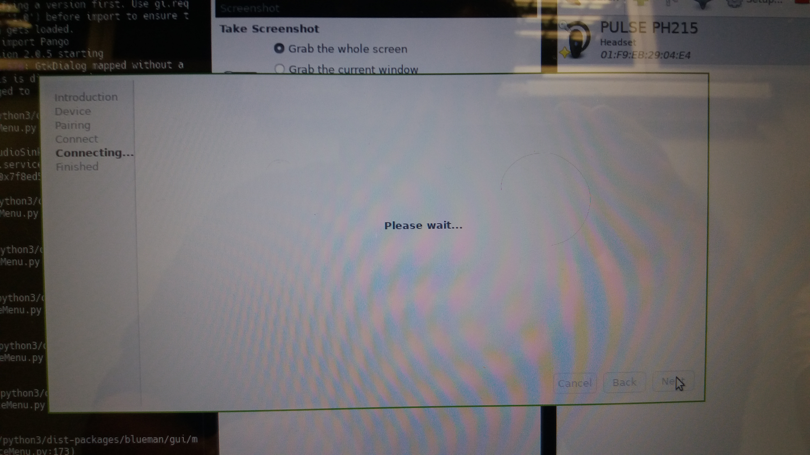
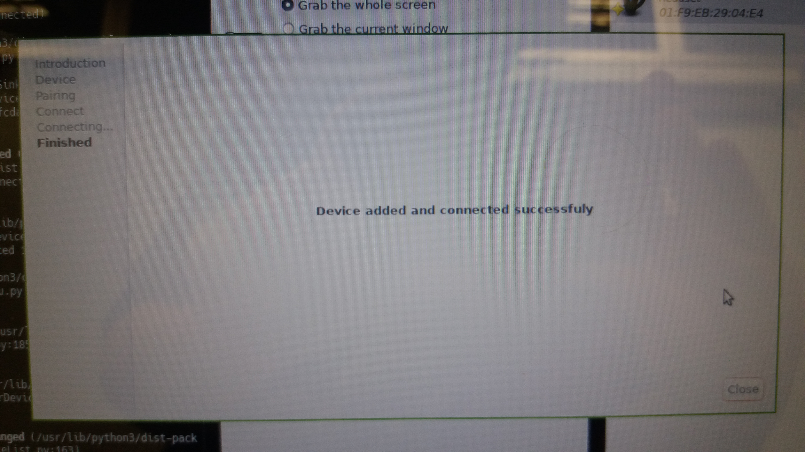
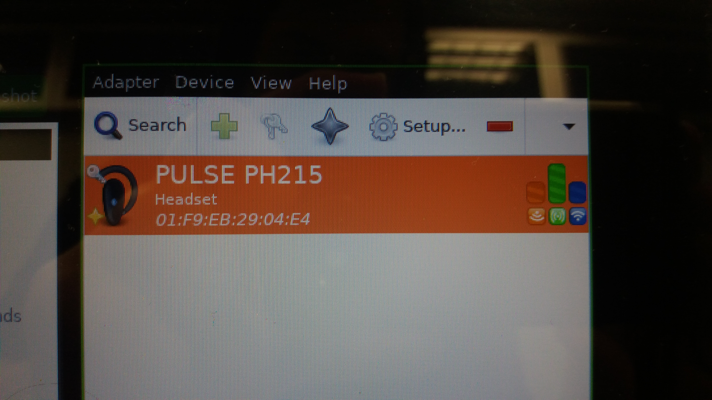

# Bluetooth system on I3

* Here you will learn how to setup bluetooth on i3wm

## Initiate bluetooth

* Fist of all, check if you have the bluetoothctl on your computer

```bash
bluetoothctl --version
```
* **bluetoothctl** is the program to control what to do in the bluetooth inside your computer, but doesn`t have a visualizer to understand what programs you have, so you are going to use him justo for initiate bluetooth on your system:

```bash
# Start bluetoothctl
$ bluetoothctl
[bluetooth]$ power on
```

## Install Blueman

* **Blueman** is a GUI manager to bluetooth on your system

* Install Dependencies like above:

```bash
sudo apt-get install bluetooth bluez bluez-tools rfkill -y
```

* check if the Bluetooth is locked, using the command **rfkill**

```bash
sudo rfkill list
```

* If is locked, use the following command

```bash
sudo rfkill unblock bluetooth
```

* You can start bluetooth too like the following command

```bash
sudo service bluetooth start
```

* Now we are going to install **blueman**

```bash
sudo apt-get install blueman
```

* To start blueman, use:

```bash
blueman-manager
```

## Use Blueman

* Check if the bluetooth is `always visible`, on `Adapter/Preferences/Always Visible`



* Select the device you want to connect and click with the second mouse button and select `Setup...`


* Afer that Select the button `Next`



* Wait a bit while he tries to connect



* If everything was right, it will show this message



* It will show this icons and info on the right side of your devices



* It will show the bluetooth icon on the i3bar too


