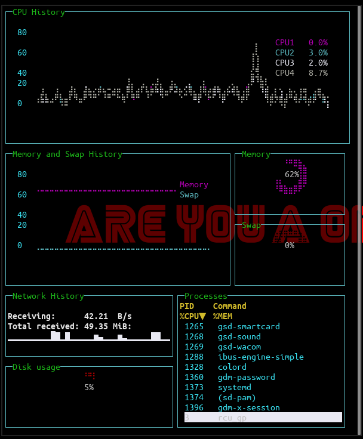

# Instalando e Configurando o Gtop

* **Gtop** e um programa de controle do seu sistema, onde voce pode ver o que esta acontecendo no computador e todas as informacoes que precisa para verificar o status de memoria e programas

## Como Instalar

1. Baixe o Node em seu computador
    * `sudo apt-get install nodejs`

2. Baixe o NPM em seu computador
    * `sudo apt-get install npm`

3. Baixe o gtop como abaixo
    * `sudo npm install gtop -g`

4. Agora teste o gtop
    *  `gtop`