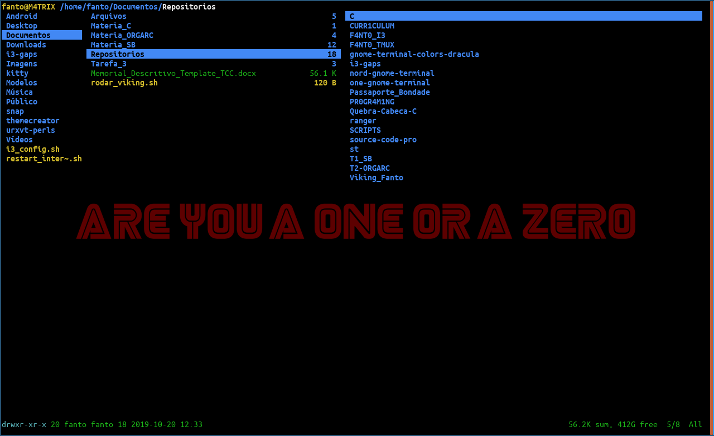

# Como instalar e usar o Ranger

* **Ranger** auxilia em ver os arquivos pelo Terminal, sem precisar abrir uma GUI visualizacao

## Instalacao

* Faca Clone do Ranger do Github:
    * `git clone https://github.com/ranger/ranger.git`

* Acesse dentro do Diretorio:
    * `cd ranger`

* Coloque o seguinte comando no terminal:
    *  `sudo python setup.py install --optimize=1 --record=install_log.txt`

* Para ver se instalou, escreva no terminal:
    * `ranger`

## Uso

* Toda vez que deseja ver todos os diretorios e arquivos de um Diretorio so escreva no terminal:

* `ranger` ou `xdg-open .`