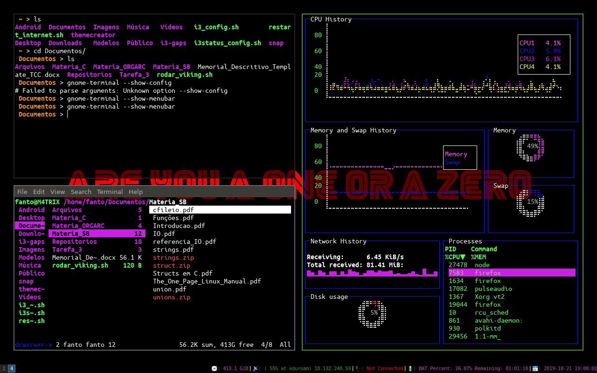

## Arquivo de Tema do meu i3wm

* Para baixar o Profile do seu S.O, digite o seguinte comando:

```sh
dconf dump /org/gnome/terminal/legacy/profiles:/ > gnome-terminal-profiles.dconf

```

* Para instalar o Profile do seu S.O, digite o seguinte comando:
    * Va onde esta o seu arquivo `.dconf` deste tema neste Diretorio e use o seguinte comando:

```sh
dconf load /org/gnome/terminal/legacy/profiles:/ < gnome-terminal-profiles.dconf
```

O arquivo que se encontra neste diretorio e o meu arquivo de cores do meu sistema


